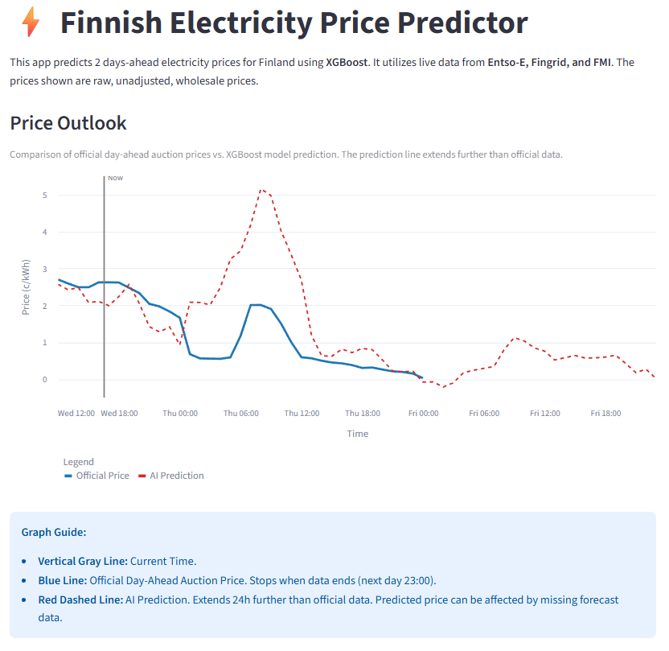
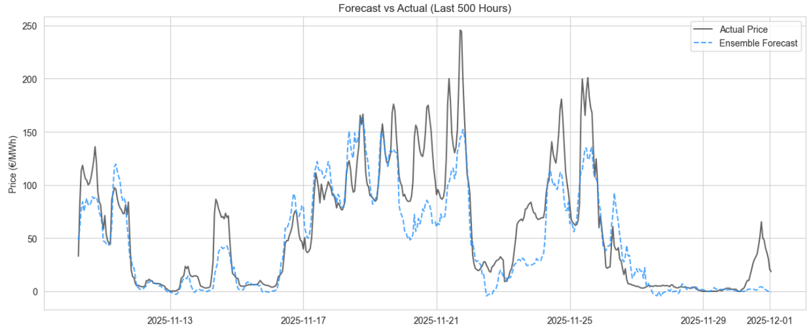
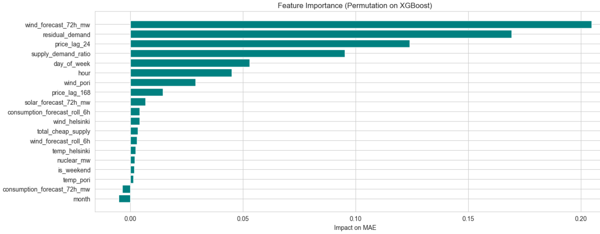
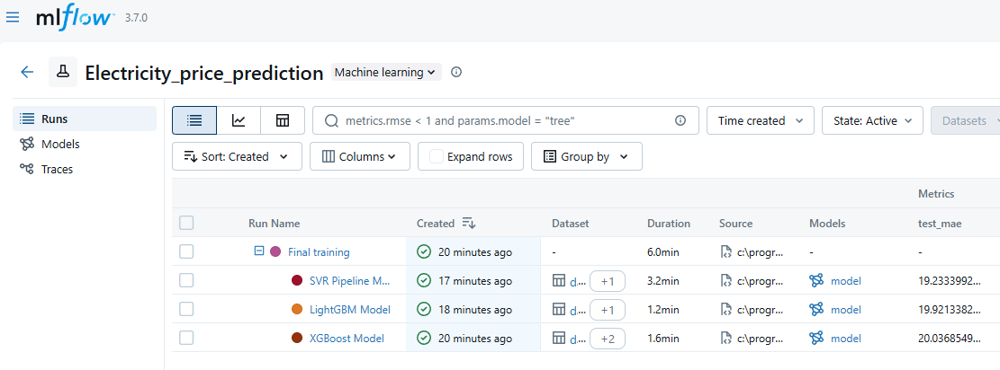
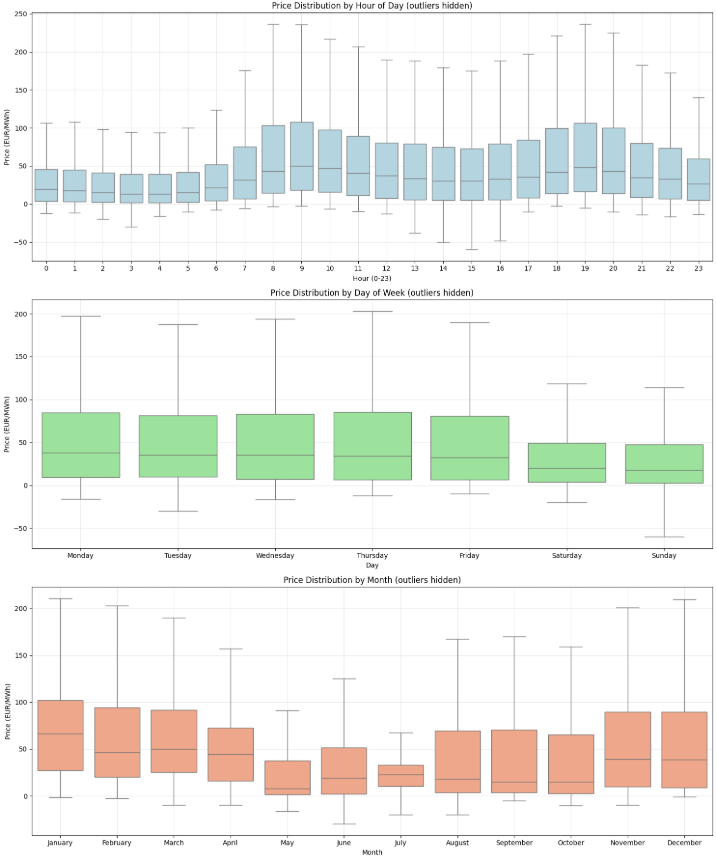

# Finnish Electricity Price Predictor (MLOps Pipeline)

An end-to-end Machine Learning pipeline that forecasts Day-Ahead Spot Prices (Nord Pool) for Finland. The system runs fully autonomously, fetching live data from energy APIs, generating predictions via XGBoost, and updating a live dashboard every day.

**[View Live Dashboard](https://finnish-electricity-price-prediction-u7m9u78zeukqum9gytrchj.streamlit.app/)**

---

## Project Overview

Electricity prices in Finland have become highly volatile due to the reliance on wind power and the specific mechanics of the Nord Pool exchange. This project aims to predict these fluctuations using a Machine Learning approach.

Unlike simple time-series models, this system models the Grid Physics (Supply vs. Demand) by integrating real-time weather forecasts, nuclear production data, and wind power generation.

### Key Features
*   **Autonomous MLOps:** A daily GitHub Action pipeline fetches data, runs inference, and commits results without human intervention.
*   **Interactive Dashboard:** Built with Streamlit to visualize price outlooks and model accuracy.
*   **Model Training:** Model hyperparameters optimized using Optuna and tracked with MLflow.

---

## Architecture

The pipeline is designed to be stateless and cloud-native.

1.  **Data Ingestion:** Scripts fetch 48h history + 72h forecasts from **Fingrid** (Grid), **FMI** (Weather), and **Entso-E** (Markets).
2.  **Processing:** Data is aligned to `Europe/Helsinki` time, interpolated, and features are engineered (e.g., `residual_demand`).
3.  **Inference:** A pre-trained XGBoost model predicts the next 72 hours.
4.  **Deployment:** Results are saved to the repo, triggering a Streamlit update.

---

## Tech Stack

*   **Core:** Python 3.10, Pandas, NumPy
*   **Machine Learning:** XGBoost, Scikit-Learn
*   **Optimization:** Optuna (Hyperparameter tuning), MLflow (Experiment tracking)
*   **Data Sources:**
    *   `entsoe-py` (European Market Data)
    *   `fmiopendata` (Finnish Meteorological Institute)
    *   `requests` (Fingrid Open Data API)
*   **DevOps:** GitHub Actions (CI/CD), Streamlit Cloud

---

## Model Performance

To validate the value of the ML approach, I benchmarked the final model against several baselines.

| Model | MAE (€/MWh) | Improvement |
| :--- | :--- | :--- |
| **Global Mean (Naive)** | 42.43 | 0% |
| **Persistence (Yesterday's Price)** | 39.02 | +8.0% |
| **Linear Ridge Regression** | 25.04 | +41.0% |
| **XGBoost (Tuned)** | **20.04** | **+52.7%** |

### Forecast Accuracy
The model successfully captures the daily volatility and price spikes, closely tracking the actual market price.

### Feature Importance 
The model identified **Wind Forecasts** and **Residual Demand** (Consumption minus Cheap Supply) as the primary drivers of price. This confirms the model learned the fundamental economics of the grid rather than just memorizing past patterns.

## Experiments & Tuning (MLOps)

I used MLflow and Optuna to test different architectures and hyperparameters.
*   **Architectures Tested:** XGBoost, LightGBM, SVR (Support Vector Regression).
*   **Strategy:** While the Ensemble (Voting) offered a marginal improvement (MAE 19.24), I selected the single **XGBoost** model for production to balance accuracy with inference latency.

## Data Analysis (EDA)

Price Distribution Plots

I analyzed the seasonality of Finnish electricity prices to inform feature engineering.
*   **Hourly:** Prices peak at 08:00 and 19:00.
*   **Weekly:** Saturdays and Sundays are significantly cheaper.
*   **Monthly:** Winter months show higher volatility due to heating demand.

